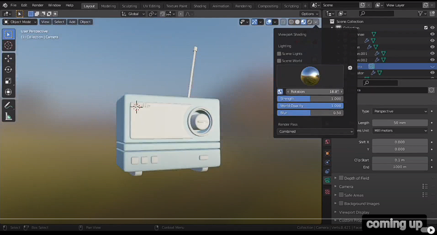
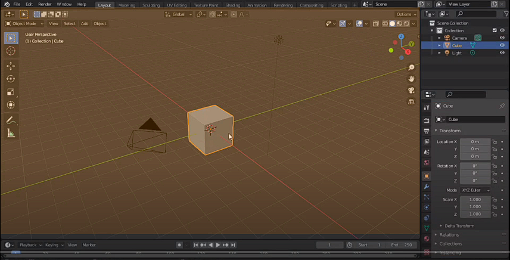
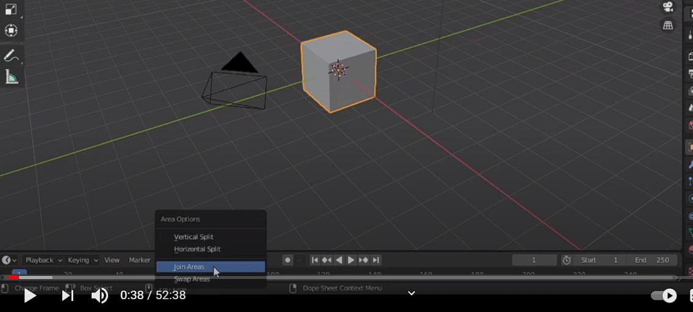
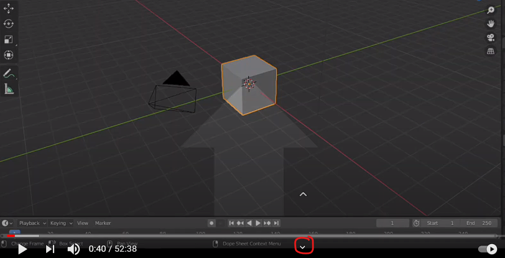
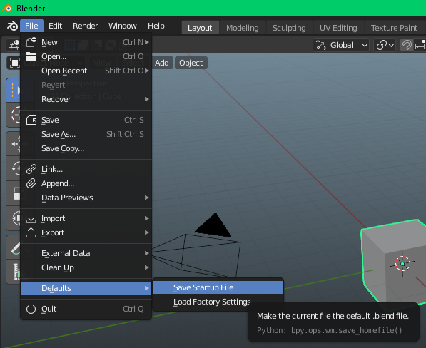

# [Руководство по Blender](../blender_tutorials.md)

## 
 Радиоприемник 

<iframe src="https://www.youtube.com/embed/SavoO7ZuY5w" frameborder="0" allow="accelerometer; autoplay; clipboard-write; encrypted-media; gyroscope; picture-in-picture" allowfullscreen
    style="position: absolute;
        top: 0;
        left: 0;
        width: 100%;
        height: 100%;"></iframe>

Это руководство будет основано на проекте, поэтому я не буду утомлять вас длинными теориями. Сначала вы обучитесь всем необходиммым инструментам и вещам в моделировании на пути к созданию этого простого радиоприемника

При открытии нового проекта **`Blender`**, первое, что вы увидите - это несколько разных редакторов. Самый большой, который вы видите здесь, называется
**`окно просмотра 3D (Viewport 3D Editor)`**. Мы проведем большую часть этого курса в этом редакторе

Редактор снизу называется **`редактором шкалы времени (Timline Editor)`**

Нам не понадобится этот редактор в этом
курсе, так что мы можем избавиться от него прямо сейчас. Самый простой способ закрыть любой редактор - это просто переместить курсор мыши на границу между 2-мя редакторами до момента, когда курсор изменится на двустороннюю стрелку. Затем щелкните правой кнопкой мыши и выберите **`области соединения (Join Areas)`**

Затем поместите стрелку внизу редактора, так как мы хотим, чтобы **`Timeline Editor`** был скрыт
и щелкните левой кнопкой мыши, чтобы закрыть

Затем перейдите во вкладку **`Файл -> По умолчанию -> Сохранить файл запуска (File -> Default -> Save Startup File)`**, чтобы **`Blender`** запомнил изменения в следующий раз. Всегда можно вернуть заводские настройки выбрав опцию **`Загрузить заводские настройки (Load Factory Settings)`**

теперь перейдите к опции редактирования выше и
выберите предпочтения
здесь появляется отдельное новое окно
выберите темы, затем под предустановкой
вы можете выбрать любой понравившийся, если вы
не нравится по умолчанию
затем перейдите к вводу и включите эмуляцию
цифровая клавиатура, если у вас нет цифровой клавиатуры
В данный момент
и включите эмуляцию 3-х кнопочной мыши, если
у тебя этого тоже нет
затем перейдите к раскладке клавиатуры и под предпочтениями
убедитесь, что выбран левый щелчок
включен не правый клик
и, наконец, перейти в систему и под
память и ограничения
измените шаги отмены на 64. это может
быть полезным позже
если вы случайно что-то измените, вы
не должно быть тогда вам не нужно