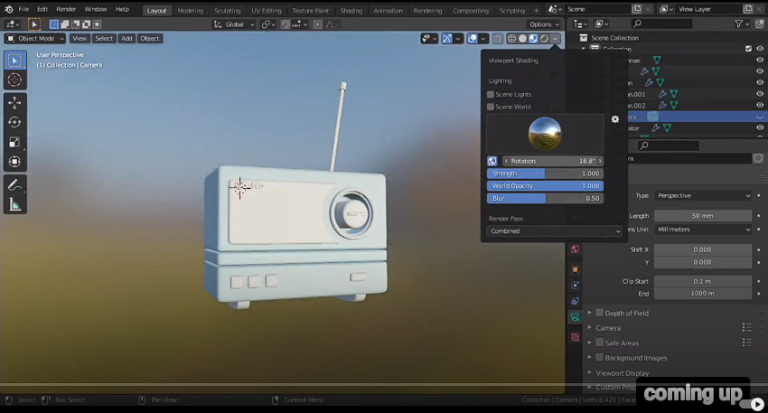
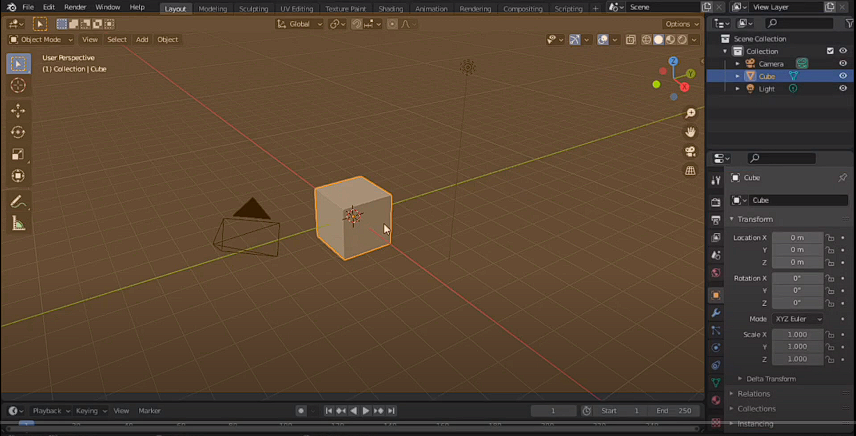
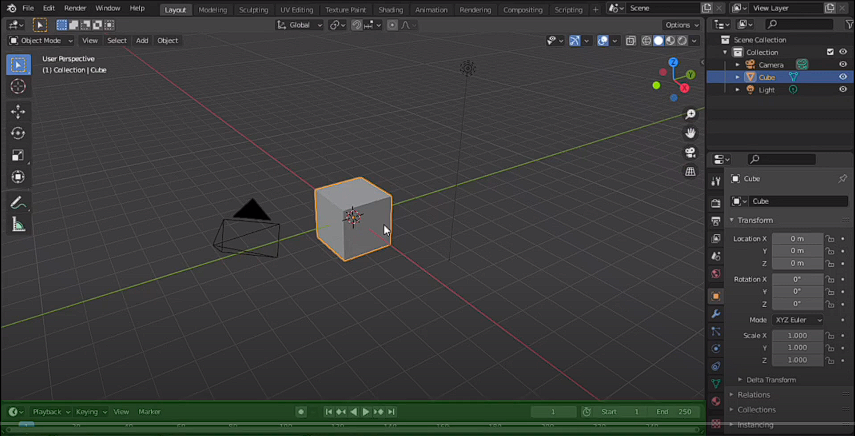
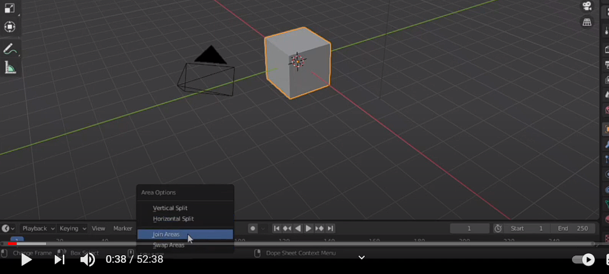
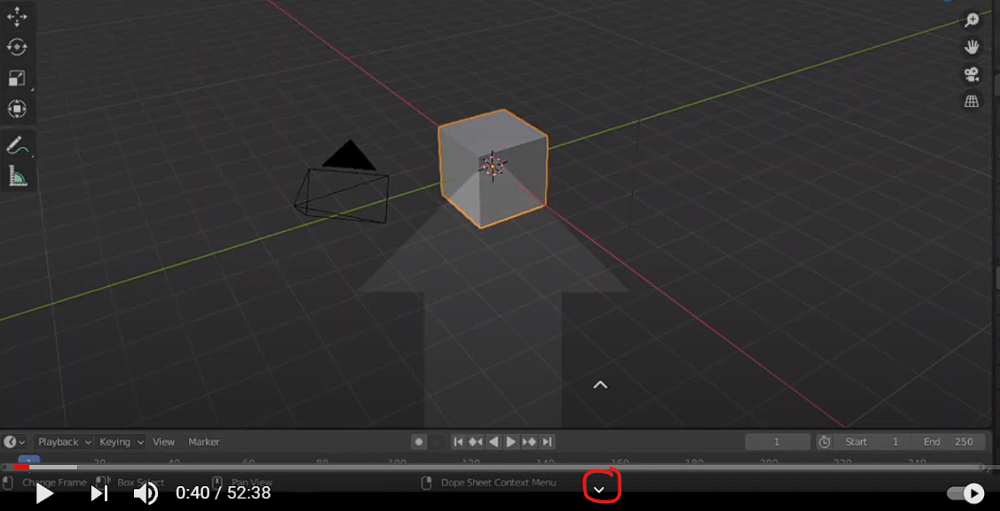
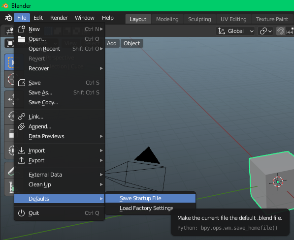
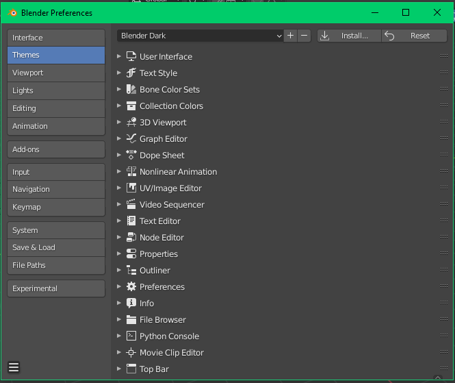
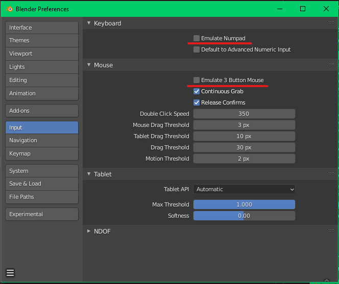
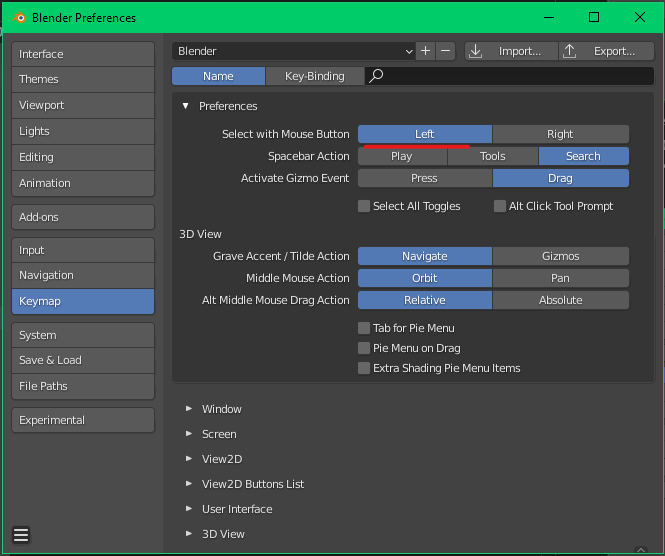
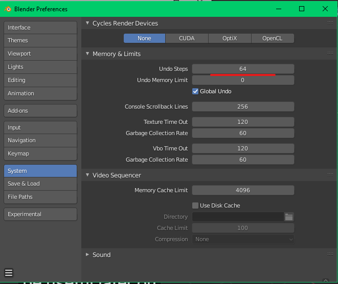

# [Руководство по Blender](../tutorials.md)

## [Радиоприемник](radio_00.md)

### 
 Настройка рабочего окружения 

Это руководство будет основано на проекте, поэтому я не буду утомлять вас длинными теориями. Сначала вы обучитесь всем необходиммым инструментам и вещам в моделировании на пути к созданию этого простого радиоприемника

При открытии нового проекта **`Blender`**, первое, что вы увидите - это несколько разных редакторов. Самый большой, который вы видите здесь, называется
**`окно просмотра 3D (Viewport 3D Editor)`**. Мы проведем большую часть этого курса в этом редакторе

Редактор снизу называется **`редактором шкалы времени (Timline Editor)`**

Нам не понадобится этот редактор в этом
курсе, так что мы можем избавиться от него прямо сейчас. Самый простой способ закрыть любой редактор - это просто переместить курсор мыши на границу между 2-мя редакторами до момента, когда курсор изменится на двустороннюю стрелку. Затем щелкните правой кнопкой мыши и выберите **`области соединения (Join Areas)`**

Затем поместите стрелку внизу редактора, так как мы хотим, чтобы **`Timeline Editor`** был скрыт
и щелкните левой кнопкой мыши, чтобы закрыть

Затем перейдите во вкладку **`Файл -> По умолчанию -> Сохранить файл запуска (File -> Default -> Save Startup File)`**, чтобы **`Blender`** запомнил изменения в следующий раз. Всегда можно вернуть заводские настройки выбрав опцию **`Загрузить заводские настройки (Load Factory Settings)`**

Теперь перейдите к настройкам редактра: **`Edit -> Preferences...`**. Появляется отдельное новое окно.
В вкладке **`Themes`** можно выбрать любую понравившуюся тему

Затем перейдите к вкладке **`Input`** и включите эмуляцию цифровой клавиатуры, если у вас нет цифровой клавиатуры в данный момент и включите эмуляцию 3-х кнопочной мыши, если у тебя этого тоже нет

Затем перейдите к раскладке клавиатуры **`Keymap`** и под предпочтениями убедитесь, что выбран левый щелчок - включен не правый клик

И, наконец, перейдите в **`System`** и под
**`Memory & Limits`** измените шаги отмены на 64. Это может быть полезным позже

Если вы случайно что-то измените, что вам не нужно, то не волнуйтесь - вы можете просто **`загрузить настройки по молчанию (Load Factory Settings)`**. Теперь вы можете закрыть окно настроек

### [Далее](radio_02.md)