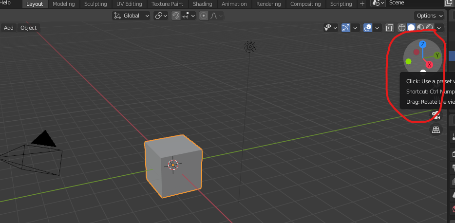
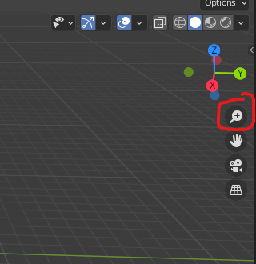
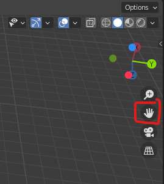
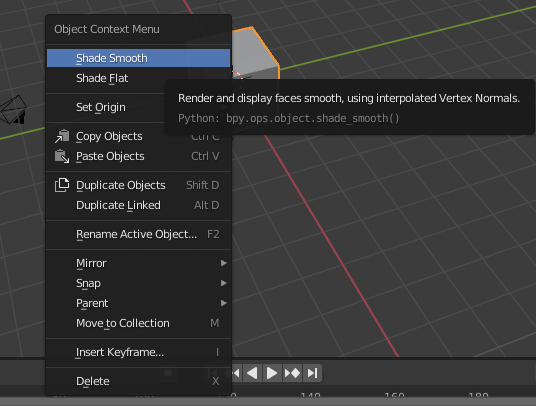
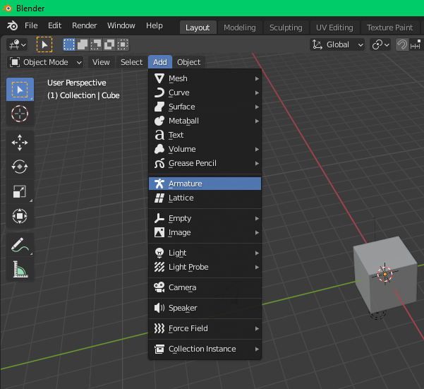
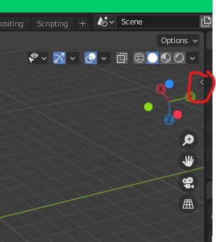
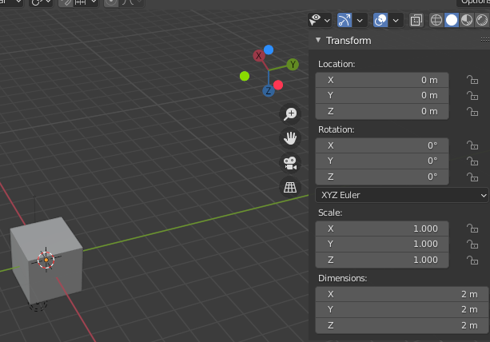
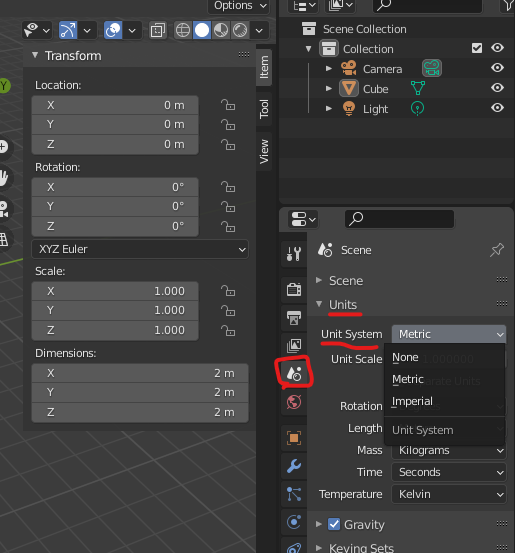

# [Руководство по Blender](../blender_tutorials.md)

## [Радиоприемник](radio_00.md)
### [Назад](radio_02.md)

### 
 Обучение работе с UI Blender 

#### 
 Вращение во Viewport 

Теперь, если вы наведете курсор на эту область разноцветных точек, а затем щелкнете левой кнопкой мыши удерживая и двигая вы можете вращаться вокруг **`Viewport 3D`**

**`Комбинация клавиш для быстрого вызова (Shortcut)`** для использования этого - это просто зажмите **`среднюю кнопку мыши (Scroll)`** и двигайте мышью. Те, у кого нет трехкнопочной мыши, то при включении эмуляции трехкнопочной мыши, это можно сделать, удерживая нажатую клавишу **`Alt`** и **`левую кнопку мыши`** и двигая мышь.

#### 
 Масштабирование во Viewport 

Теперь, если вы щелкнете левой кнопкой мыши по значку **`лупы +`** и будете двигать мышью вперед-назад, вы сможете приближать и отдалять предметы 

**Другие способы масштабирования объектов:**
1. Зажать **`Ctrl + Scroll`** и двигать мышью вперед-назад
2. Зажать **`Ctrl + Alt + LMB (левая кнопка мыши)`** и двигать мышью вперед-назад
3. **`Прокрутка Scroll'а`** 

#### 
 Перемещение сцены во Viewport 

Если вы щелкните **`левой кнопкой мыши (LMB)`**, удерживая, и перетащите этот значок руки, то сможете перемещать сцену во Viewport

**Другие способы это сделать:**
1. Зажать **`Shift + Scroll`** и двигать мышью
2. Зажать **`Shift + Alt + LMB`** двигать мышью

#### 
 Взаимодействие с объектами 

Во Viewport 3D по умолчанию есть: 
1. **`Сетка куба (Cube Mesh)`**
2. **`Камера (Camera)`**
3. **`Освещение (Lamp)`**

**Для выбора объекта вы можете:** 
1. Щелкнуть **`левой кнопкой мыши (LMB)`** по объекту
2. Выделить нужные объекты удерживая **`LMB`**

Затем для выбранных объектов, если вы щелкните **`правой кнопкой мыши (RMB)`** вы получаете некоторое контекстные меню объекта. Вы получите разные меню для разных видов объектов

**Способы удаления объекта:**
1. Через вызванной **`контекстное меню`** после выделения объекта
2. Выделить объект и нажать **`X`** лиюо клавиша удаления на клавиатуре, а затем подтвердить действие левой кнопкой мыши

**Способы добавления объектов:**
1. Нажать на кнопку **`Add`** вверху **`Viewport'а`** и выбрать необходимый объект
2. Нажать **`Shift + A`** и выбрать необходимый объект

Выбрав куб, можно посмотреть некоторые его свойства (характеристики) в скритом меню. Для этого надо открыть это меню, нажав на маленькую стрелочку справа или передвинув ее влево. Другой способ раскрыть/скрыть данное менб справа: нажать **`N`**

Во вкладке **`Item/Transform`** вы можете увидеть
размеры этого куба 

Система единиц метрическая по умолчанию, но вы можете изменить его на другой. Если вы предпочитаете это делать, то перейдите к свойствам сцены и под **`Units`** измените систему единиц

### [Далее](radio_03.md)