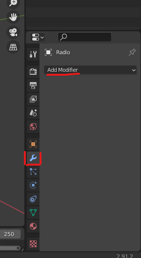
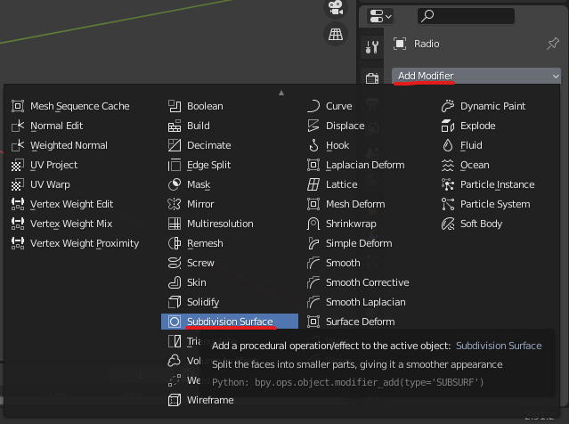
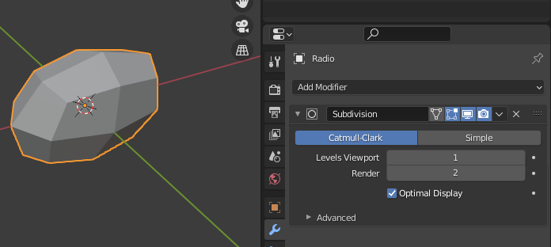
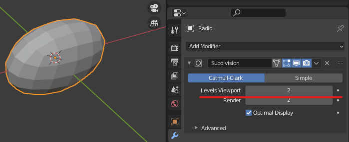
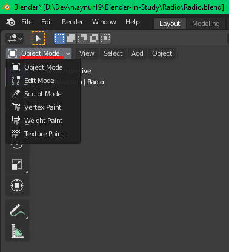
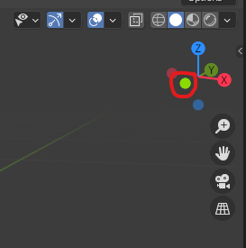
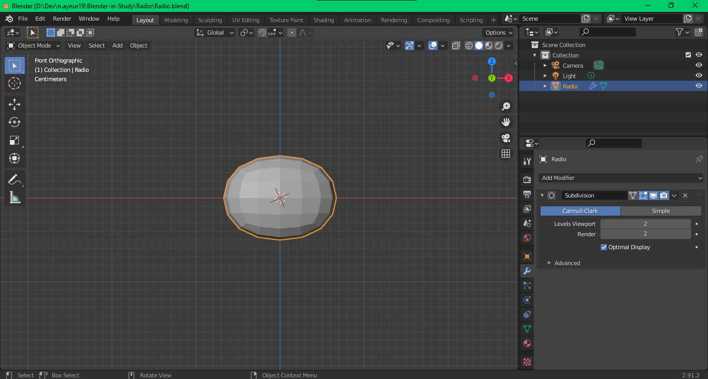
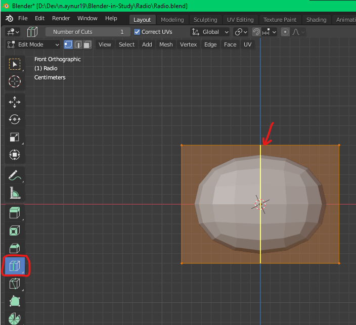
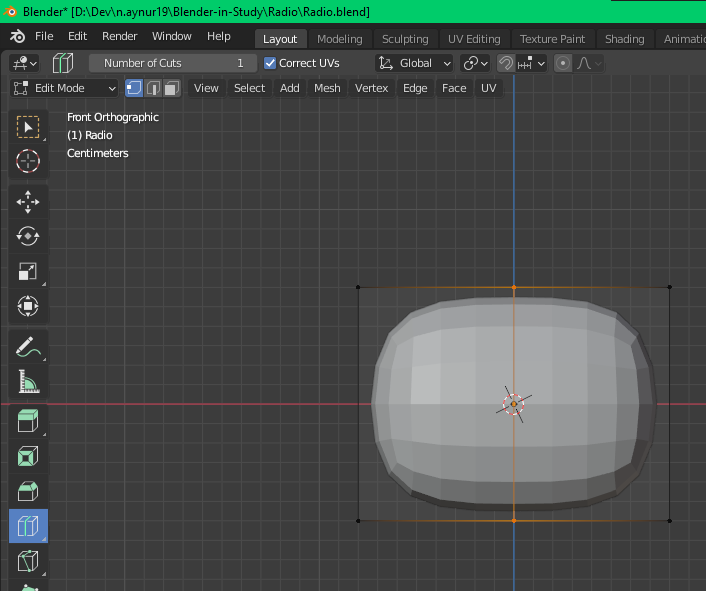
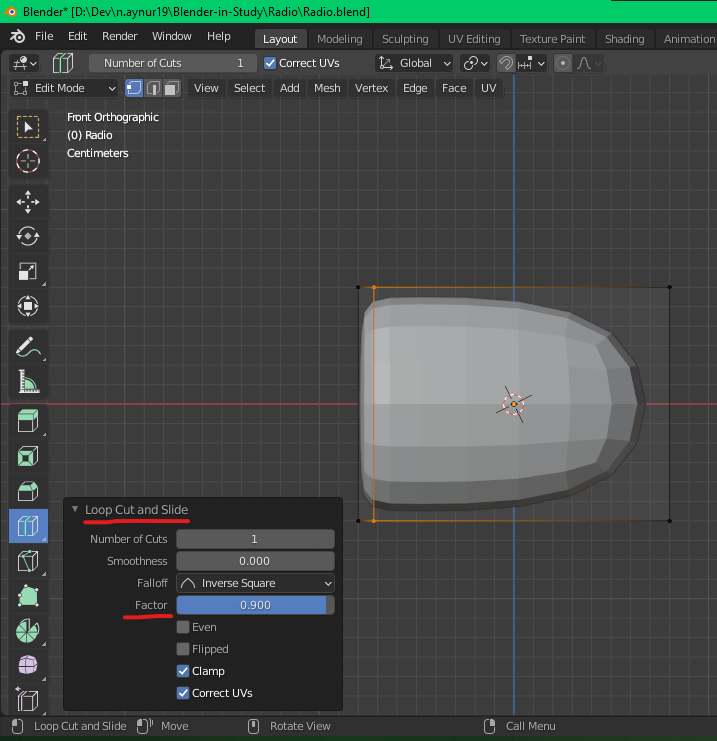

# [Руководство по Blender](../blender_tutorials.md)

## [Радиоприемник](radio_00.md)
### [Назад](radio_02.md)

### 
 Создание основы радиоприемника 

**Сделаем размер радиоприемника следующим: `16cm x 8cm x 12cm (x y z)`**

Кнопка **`. (del) на цифровой клавиатуре (Numpad)`** приближает сфокуссированный (выделенный) объект

Всегда полезно давать объектам осмысленные названия, чтобы у вас не было проблем с поиском. Способы поменять название объекта:
1. В иерархии объектов двойным щелчком **`LMB`** заменить старое название и клавишей **`Enter`** подтвердить новое
2. Выделить объект, нажать **`F2 (Fn + F2)`**, заменить старое название и клавишей **`Enter`** подтвердить новое

Теперь, если вы будете вращать созданный объект, удерживая **`Scroll`**, то вы можете увидеть, что этот объект имеет очень острые края и углы. Но в реальности все повседневные предметы в вашем окружении не имеют острой отделки: у каждого из них есть хоть какие-то скосы (закругления)

Чтобы сделать это в **`Blender`** есть несколько разных способов. Рассмотрим один из них

Выделите объект и нажмите на **`синий значок гаечного ключа (blue wrench icon)`**. Нажмите на кнопку **`Add Modifier (Добавить модификатор)`**

Добавьте модификатор **`Subdivision Surface`** из второго подразделения 

Данный модификатор добавил больше вершин к нашей модели

Каждая грань куба разделась на четыре грани. Мы также можем увеличить или уменьшить разделений гранией, увеличивая количество вершин в опции **`Levels Viewport`**. Давайте пока установим 2-й уровень

Очевидно, это уже не выглядит как куб (параллелепипед) больше. Нам нужно исправить это. В данный момент мы находимся в **`объектном режиме (Object Mode)`**. Нам нужно переключиться на **`режим редактирования (Edit Mode)`**, чтобы двигаться дальше. **Способы переключания объектного режима и режима редактирования:**

1. Выбрать вверху Viewport'а в выпадающем списке необходимый режим
2. Переключаться между **`Object/Edit Mode`** с помощью клавиши **`Tab`**

Теперь щелкните левой кнопкой мыши на зеленой вершине без буквы **`Y`** на нем. Это перенесет вас на **`вид спереди (Front View)`**

Способы поменять вид:
1. Нажать на вершину из рисунка выше:
    - **`зеленая (Y)`** - вид спереди/сзади
    - **`красная (X)`** - вид с боку
    - **`синяя (Z)`** - вид сверху/снизу
2. Использовать **`цифровую клавиатуру (Numpad)`**:
    - **`1`** - вид спереди 
    - **`3`** - вид с боку 
    - **`7`** - вид сверху 
    - **`9`** - вид с обратной стороны модели

Если нет **`Numpad'а`**, то при включении его эмуляции цифры также будут работать на цифрах над буквами основной клавиатуры

Теперь в **`режиме редактирования (Edit Mode)`** выберите слева инструмент **`циклического сечения (Loop Cut)`**, подведите курсор к горизонтальному краю оранжевого параллелепипеда (это что-то наподобие каркаса нашей модели) и щелкните **`левой кнопкой мыши (LMB)`**, чтобы сделать надрез

Затем раскройте внузу **`Viewport'а`** инструмент **`Loop Cut and Slide`** на панели оператора. Если
вы перетаскиваете **`ползунок фактора (Factor)`** на отрицательное значение, то рёберная петля перемещается на правую сторону, а ползунок перетаскиваете на положительное значение, то рёберная петля перемещается влево

Теперь поместите курсор рядом с вертикальным краем оранжевого прямоугольника и щелкните левой кнопкой мыши, чтобы сделать надрез

теперь, если вы перетащите ползунок фактора на

отрицательное значение, к которому переходит контур края

верхняя сторона

и если вы перетащите ползунок фактора на

положительное значение, к которому переходит краевой цикл

нижняя сторона

теперь предположим, что вам нужно настроить
устанавливает положение петли
если вы попытаетесь сдвинуть множитель, только
активный цикл затронут
это означает, что сначала нам нужно сделать
этот краевой цикл активен
и чтобы сделать его активным, нам нужно выбрать
так что перейдите к инструменту выделения
прежде чем двигаться вперед, позвольте мне сказать вам
как вы можете выбирать вершины
ребра или грани в режиме редактирования для выбора
вершины