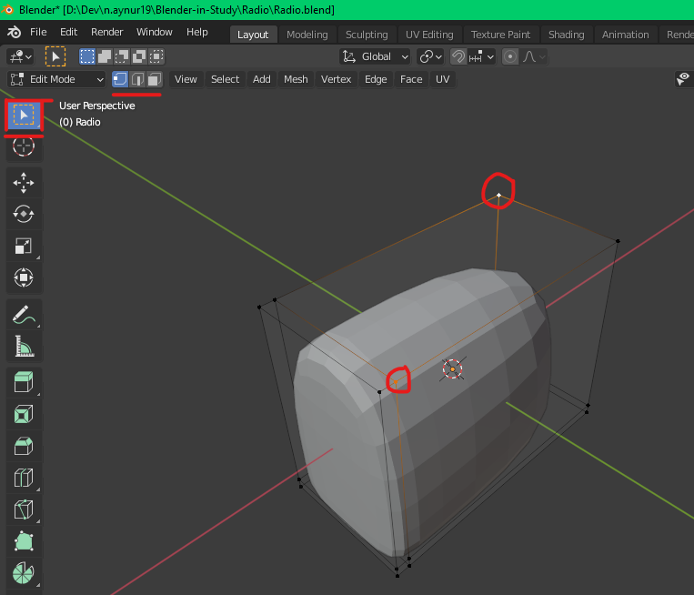

# [Руководство по Blender](../blender_tutorials.md)

## [Радиоприемник](radio_00.md)
### [Назад](radio_02.md)

### 
 Создание основы радиоприемника 

**Сделаем размер радиоприемника следующим: `16cm x 8cm x 12cm (x y z)`**

Кнопка **`. (del) на цифровой клавиатуре (Numpad)`** приближает сфокуссированный (выделенный) объект

Всегда полезно давать объектам осмысленные названия, чтобы у вас не было проблем с поиском. Способы поменять название объекта:
1. В иерархии объектов двойным щелчком **`LMB`** заменить старое название и клавишей **`Enter`** подтвердить новое
2. Выделить объект, нажать **`F2 (Fn + F2)`**, заменить старое название и клавишей **`Enter`** подтвердить новое

Теперь, если вы будете вращать созданный объект, удерживая **`Scroll`**, то вы можете увидеть, что этот объект имеет очень острые края и углы. Но в реальности все повседневные предметы в вашем окружении не имеют острой отделки: у каждого из них есть хоть какие-то скосы (закругления)

Чтобы сделать это в **`Blender`** есть несколько разных способов. Рассмотрим один из них

Выделите объект и нажмите на **`синий значок гаечного ключа (blue wrench icon)`**. Нажмите на кнопку **`Add Modifier (Добавить модификатор)`**

Добавьте модификатор **`Subdivision Surface`** из второго подразделения 

Данный модификатор добавил больше вершин к нашей модели

Каждая грань куба разделась на четыре грани. Мы также можем увеличить или уменьшить разделений гранией, увеличивая количество вершин в опции **`Levels Viewport`**. Давайте пока установим 2-й уровень

Очевидно, это уже не выглядит как куб (параллелепипед) больше. Нам нужно исправить это. В данный момент мы находимся в **`объектном режиме (Object Mode)`**. Нам нужно переключиться на **`режим редактирования (Edit Mode)`**, чтобы двигаться дальше. **Способы переключания объектного режима и режима редактирования:**

1. Выбрать вверху Viewport'а в выпадающем списке необходимый режим
2. Переключаться между **`Object/Edit Mode`** с помощью клавиши **`Tab`**

Теперь щелкните левой кнопкой мыши на зеленой вершине без буквы **`Y`** на нем. Это перенесет вас на **`вид спереди (Front View)`**

Способы поменять вид:
1. Нажать на вершину из рисунка выше:
    - **`зеленая (Y)`** - вид спереди/сзади
    - **`красная (X)`** - вид с боку
    - **`синяя (Z)`** - вид сверху/снизу
2. Использовать **`цифровую клавиатуру (Numpad)`**:
    - **`1`** - вид спереди 
    - **`3`** - вид с боку 
    - **`7`** - вид сверху 
    - **`9`** - вид с обратной стороны модели

Если нет **`Numpad'а`**, то при включении его эмуляции цифры также будут работать на цифрах над буквами основной клавиатуры

Теперь в **`режиме редактирования (Edit Mode)`** выберите слева инструмент **`циклического сечения (Loop Cut)`**, подведите курсор к горизонтальному краю оранжевого параллелепипеда (это что-то наподобие каркаса нашей модели) и щелкните **`левой кнопкой мыши (LMB)`**, чтобы сделать надрез

Затем раскройте внузу **`Viewport'а`** инструмент **`Loop Cut and Slide`** на панели оператора. Если
вы перетаскиваете **`ползунок фактора (Factor)`** на отрицательное значение, то контур рёбера перемещается на правую сторону, а если ползунок перетаскиваете на положительное значение, то контур ребра перемещается влево

Теперь поместите курсор рядом с вертикальным краем оранжевого прямоугольника и щелкните левой кнопкой мыши, чтобы сделать надрез. Теперь, если вы перетащите **`ползунок фактора (Factor)`** на отрицательное значение, то контур ребра перемещается к верхней стороне, а если вы перетащите ползунок на положительное значение, то контур ребра перемещается к нижней стороне

Теперь предположим, что вам нужно настроить устанавливамое положение контура. Если вы попытаетесь изменять только **`Factor`**, то будет затронут активный контур. Это означает, что сначала нам нужно сделать нужный контур ребра активным. Чтобы сделать его активным, нам нужно выбрать его. Для этого нужно выбрать **`инструмент выделения (Select Box)`** в левом верхнем углу **`Viewport'a`**

В режиме редактирования для выбора вершин, ребер или граней сначала необходиму указать с каким типом элементов нужно взаимодействовать. Для этого вверху **`Viewport'а`** рядом с выбором режима работы нужно выбрать один из трех вариантов:
- **`Vertex select`** - выбор вершин
- **`Edge select`** - выбор ребер
- **`Face select`** - выбор граней

Выделение элементов модели:
- **При выборе 2-х вершин одного ребра** - выделяется и данное ребро
- **При выборе всех вершин одной грани** - выделяется и данная грань 
- **Для выбора нескольких элементов** - выбирайте удержимая клавишу **`Shift`**

Чтобы выбрать ребра по контуру, можно либо выделять каждое ребро контура по отдельности, или выбрать одно ребро и в настройках сверху выбрать **`Select -> Select Loops -> Edge Loops`**

Теперь, когда вы выбрали контур, прокрутите вверх панель инструментов слева и выберите инструмент **`Edge Slide`ё`**

Теперь вы можете сдвинуть контур влево или вправо, 
щелкнув по желтому кругу **`LMB`** и перемещая в нужную сторону. Это действие аналогично ранее рассмотренному, когда мы перемещали **`ползучнок фактора (Factor)`** в панели оператора

Если отменить использование контуров, то можно это все повторить используя комбинацию **`Ctrl + R`** и перемещая **`LMB`**

При редактировании можели и до применения изменения (когда например зажата комбинация и требуется отпустить **`LMB`**), то действие текущее можно отменить нажатием на **`правую кнопку мыши (RMB)`**

Итак, вернемся к данному состоянию. Если отменить действия не получается, можно удалить модель проделать все действия до добавления контурных ребер

Добавьте вертикальный контур посередине, зажав **`Ctrl + R`** и щелкнув по **`LMB`**

Теперь выберите инструмент **`Bevel`** слева, а затем щелкните **`LMB`** по жёлтому кругу и перетащите его верх и в сторону, чтобы создать выпуклость. В панели оператора вы можете контролировать ширину

Вернитесь в **`режим выбора (Select Box)`**, перейдите на вид сверху в **`(Numpad 7)`**. Теперь добавьте горизонтальный контур **`(Ctrl + R + LMB)`**, подвигайте вверх или вниз и отмените движение с помощью нажатия на **`RMB`**. В результате добавить горизонтальный контур по середине. В этот раз, чтобы использовать инструмент **`Bevel`**, зажмите комбинацию **`Ctrl + B`**, двигайте курсор вверх/вниз чтобы и для применения щелкните **`LMB`**

Перейдите к виду спереди (Numpad 1), а затем сделайте горизонтальный разрез (контур) **`(Ctrl + R + LMB)`**, щелкните **`RMB`**, чтобы отменить движение. Затем зажмите комбинацию **`Ctrl + B`**, настроить выпуклость краев

Если вы хотите отрегулировать положение какой-то другой краевой петли (контура), то выберите это с помощью **`Alt + LMB`**, затем нажмите **`G`** и двигайте курсор мыши в нужную сторону. Чтобы двигать только по одной оси дополнитель зажмите **`среднюю кнопку мыши (Scroll)`**. Для тех, у кого нет средней кнопки мыши, можно дважды нажать **`G`** и двигать курсором вдоль одной оси

Нажмите **`Tab`**, чтобы выйти из режима редактирования и посмотреть нашу модель. Теперь это выглядит нормально, но кажется низкополигональным (угловатым) по краям

Нам нужно сделать эти края гладкими. Ошибка большинства новичков в том, что они просто увеличивают количество разбиений поля видимости (viewport, полигонов) для модели до того момента, когда модель станет выглядить гладко. Вы никогда не должны этого делать и позвольте мне сказать вам почему

но сначала переместите курсор в **`строку состояния (Status Bar)`** внизу, щелкните **`RMB`** и включите **`вывод статистики сцены (Scene Statistics)`**

Здесь вы можете увидеть количество треугольников в вашей модели. Большое количество замедлит работу компьютера и **`Blender`** может даже выйти из строя. Большее число полигонов означает, что модель **`высокополигональная (high poly)`**, а меньшее число означает, что она **`низкополигональная (low poly)`**. Всегда нужно пытаться сделать модель как можно более **`low poly`**. Поэтому всегда добавляйте лишнюю геометрию к модели, только если они необходимы

Поэтому вместо увеличения разбиений, здесь мы можем перейти к
меню объекта вверху и подбирать **`оттенки сглаживания (Shade Smooth)`**. Это делает наши модели более гладкими, без применения дополнительных геометрий к нему

Есть также возможность сделать это как было прежде, перейдя к объекту и выбрав применение **`плоских теней (Object -> Shade Flat)`**. Оттенки к можели можно применять через вызов контекстного меню по нажатию **`RMB`**

### [Далее](radio_04.md)