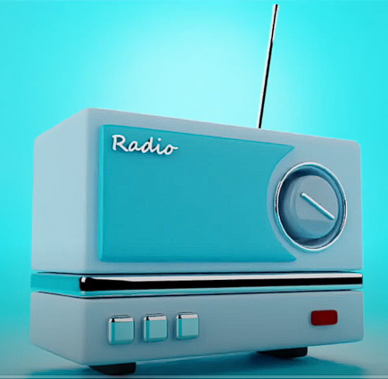
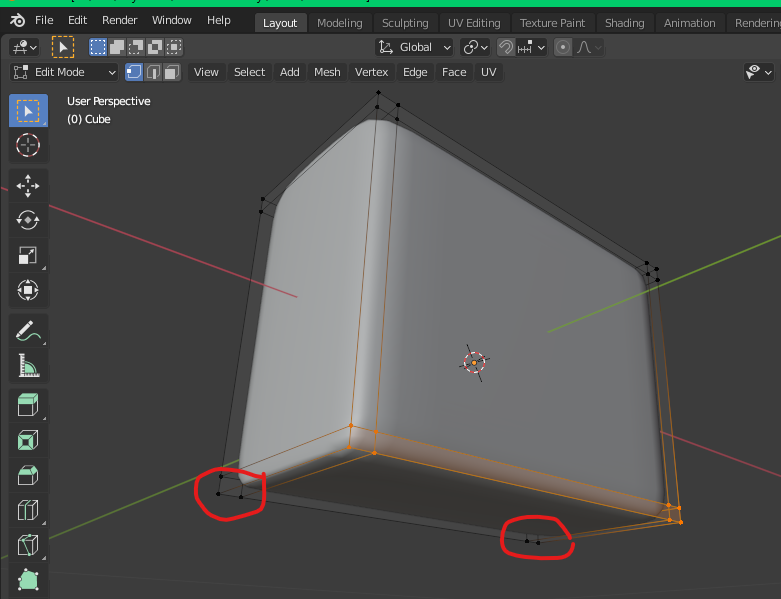
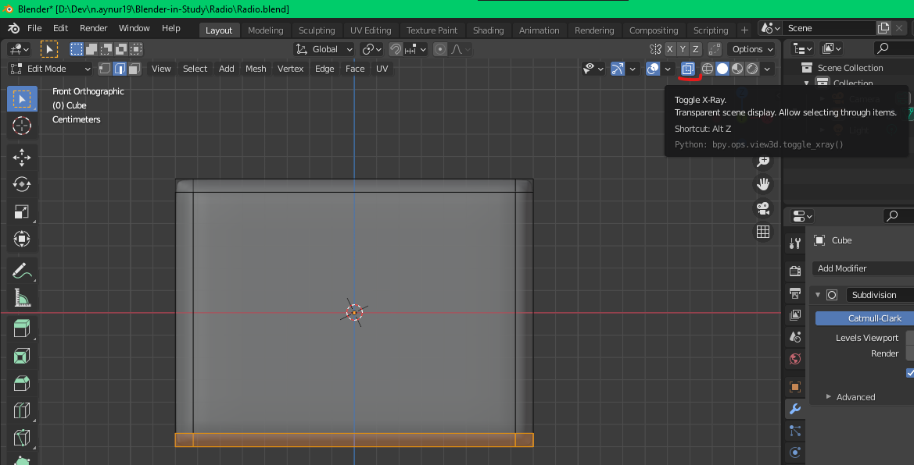
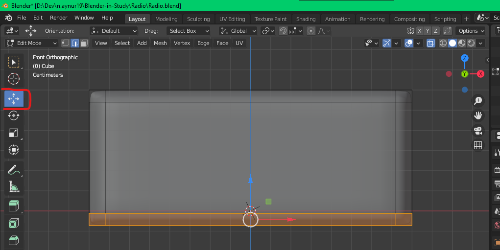
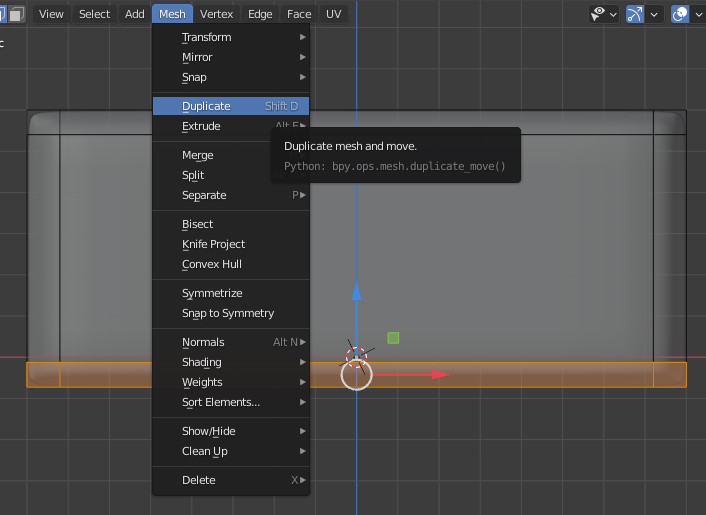
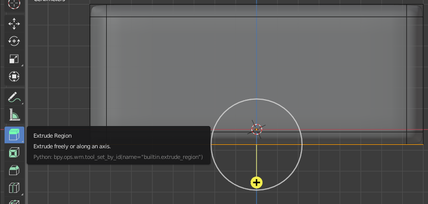
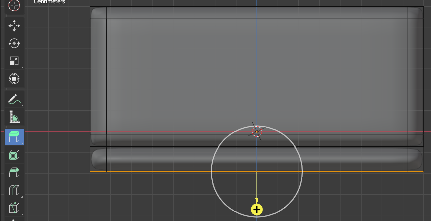
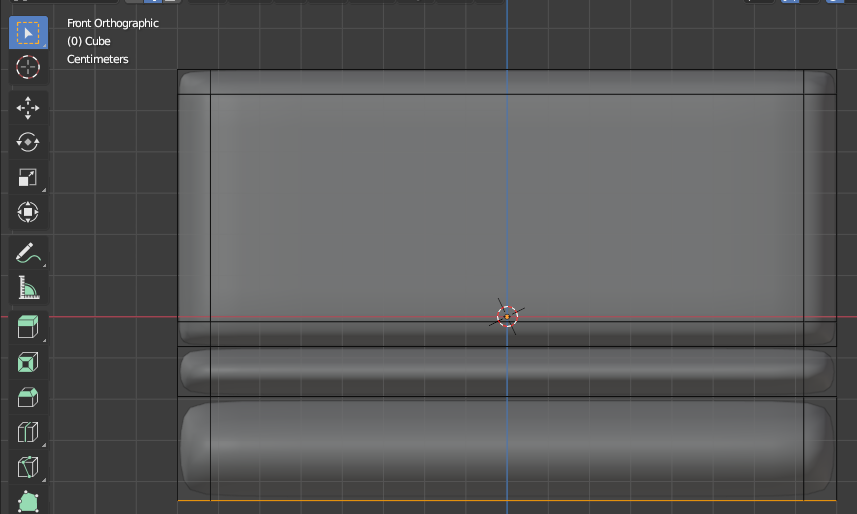
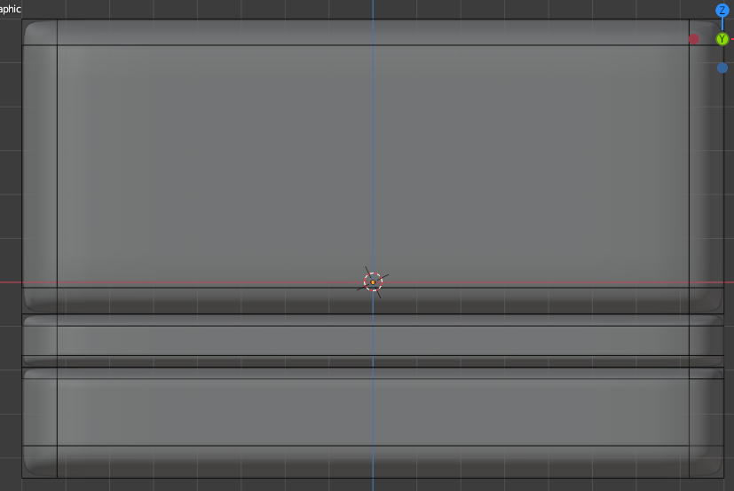

# [Руководство по Blender](../tutorials.md)

## [Радиоприемник](radio_00.md)
### [Назад](radio_03.md)

### 
 4 

Если вы посмотрите на радио, у него есть три отдельные коробки так что давайте попробуем сначала создать их

Включите режим выбора вершины, щелкните **`LMB`**  и выделите нижние вершины. Вы можете подумать, что все в порядке, но когда вы будете вращать вокруг модели, то увидете, что вершины задней части модели не выбраны

Чтобы выбрать их, включите опцию **`рентгена (X-Ray)`** с помощью комбинации **`Alt + Z`** или нажав на кнопку сверху

При включении **`X-Ray`** вы можете выбрать невидимые вершины в области выделения. Теперь нам нужно переместить эту часть немного вверх. Выберите **`инструмент перемещения (Move)`** из панель инструментов. Поскольку нам нужно переместить это вверх, то щелкните **`LMB`** по оси **`Z`** и перетащите синюю стрелку вверх. Разместите так, чтобы нижняя часть была чуть ниже оси **`X`**

Теперь снова с активным режимом **`X-Ray`** выберите
самые нижние вершины и мы продублируем их. Для этого перейдите к опции сетки вверху **`Viewport'а`** и выберите дублировать **`(Mesh -> Dublicate)`**, либо примените комбинацию к выделенным объектам **`Shift + D`**

При дублировании щелчок **`RMB`** отменяет только перемещение дубликата и ставит дубликат на то же место что и оригинал. Поэтому имейте ввиду, что щелчком **`RMB`** отменить дублирование нельзя. Для этого используйте комбинацию **`Ctrl + Z`**. При дублировании в **`Status Bar`** увеличивается количество элементов, и по этому показателю можно отследить отменилось нежелательное удаление или нет

Продублируйте нижние вершины с помощью **`Shift + D`** и просто щелкните **`RMB`**, чтобы отменить движение, затем выберите **`инструмент выдавливания (Extrude Region)`** с панели инструментов и левой кнопкой мыши выдавите выделенную область вниз немного, зажав **`LMB`** на плюсике и потянув вниз

Продублируем текущий выделенный элемент (**`Shift + D`**), отменим движение (**`RMB`**), а затем вместо использования **`инструмент выдавливания (Extrude Region)`** с панели инструментов вернемся к инструменту **`выделения (Select Box)`**. Используем горячую клавишу **`E`**, чтобы воспользоваться инструментом **`Extrude Region`**

**Сделаем горизонтальныe разрезы:** 
- 2 в нижней коробке модели **`(Ctrl + R)`**
- посередине, используя инструмент **`Bevel (Ctrl + B)`**

Выберем нижний контур верхнего бокса в режиме **`X-Ray`**, выделяя вершины, с помощью **`Alt + LMB`**. Выключаем **`X-Ray (Alt + Z)`** и 

c теперь сдвиньте петлю вниз с помощью двойной g

или просто

нажав g, а затем перетащив

средняя кнопка мыши по оси Z

теперь давайте на самом деле переименуем это как радиальное

тело

теперь давайте создадим круглое отверстие в

тело есть разные способы сделать

что в блендере

позвольте мне показать вам один из них, сначала добавьте

вертикальный разрез петли

затем скосите его, используя Ctrl + B сейчас

сдвиньте его вправо, нажав

грамм

дважды мы добавляли этот цикл, чтобы

отверстие не влияет на внешний контур

здесь

давайте добавим еще один и добавим еще один

также горизонтальный

также скосить это

а затем одну горизонтальную кроватку в

посередине и одна вертикаль посередине

теперь нам нужно соединить эти две вершины

и эти две вершины

сначала давайте выберем эти две вершины, чтобы

выберите одну вершину, а другую -

удерживая клавишу Shift

затем перейдите в меню вершин вверху и

выберите путь к вершине соединения

это соединит их, теперь выберите

два других и соедините их горячим

Брелок

